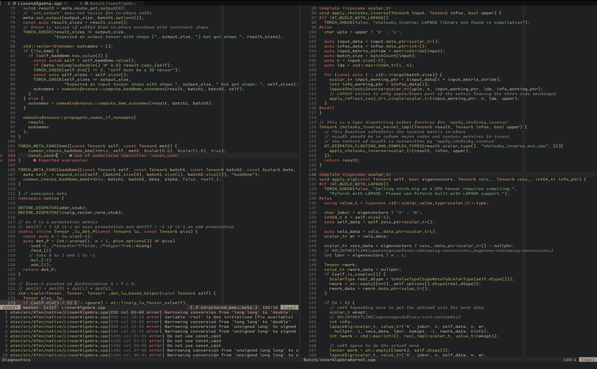

# ViRu-ThE-ViRuS

my dev setup :)

### Setup
- **TERMINAL**: kitty [ + TMUX ]
- **EDITOR**: neovim
- **SHELL**: fish
- **PKGs**: brew
- **DE**: tiles (MacOS)

#### Neovim
my config utilises a lot of plugins, and also has custom behaviours i developed
over the course of using neovim as my primary dev tool. this configuration
interacts with other elements of my overall dev setup to expose additional
functionality:
- custom statusline (with lsp, git, diagnostics, outline, resizing integration)
- custom lsp handlers (with qf, hover, highlight, navigation handling)
- custom built in terminal setup (send commands, toggle terminal, run last, etc)
- utilities like highlight current word, switch bw preferred colorschemes,
  collect all TODOs, toggle maximise buffer, etc

the config utilises a lot of the new neovim features, so i recommend using
`neovim HEAD` (or atleast 0.6+)

##### LSP
you will need to install lsp(s) manually
- **lua**: sumneko (${HOME}/.local/lsp/lua-language-server/)
- **cmake**: cmake-language-server
- **python**: pyright
- **c/c++**: clangd, clang-format, clang-tidy
- **general**: null-ls (lua_format, autopep8, prettier, flake8), universal-ctags

##### DAP
for my dap setup to work, you will need to install adapters manually
- **python**: debugpy
- **c/c++/rust**: codelldb (${HOME}/.local/codelldb/)

##### Project Setup
- see colors: `so $VIMRUNTIME/syntax/hitest.vim`
- **.clang-format**: clang-format config
- **.clang-tidy**: clang-tidy config
- **.flake8**: autopep8/flake8 config
- **pyrightconfig.json**: pyright config

### Reproduce
- run `source update_config.sh` to update local config
- run `source update_repo.sh` to update the repo with latest local config

### Notes
- tmux: setup terminfo profile using `tic -x ~/.config/tmux/terminfo`
- brew: packages in `brew_output.txt` & `brew_cask_output.txt`
- kitty: setup fonts according to `kitty/kitty.conf`
- periodically use `brew cleanup --prune 5; brew autoremove; brew doctor`
